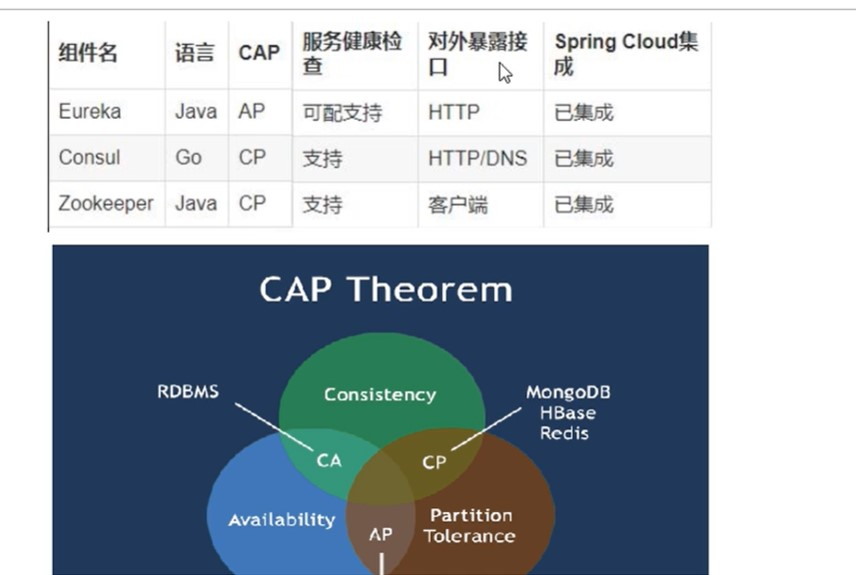

## eureka （AP）JAVA
1. 自己搭建 eureka 服务端
2. 引入maven eureka server ；@EnableEurekaServer
3. 启动服务，访问 http://localhost:7001
4. 服务注册到 eureka 中，引入 eureka client, @EnableEurekaClient
5. eureka 集群搭建
    - 修改 hosts
    - 相互注册
6. 服务注册到多个注册中心
7. 服务提供者多服务注册
    - 复制 8001项目 - 8002
    - 服务消费方使用服务名称访问服务     
        - public static final String PAYMENT_URL = "http://CLOUD-PAYMENT-SERVICE";
    - RestTemplate 配置类需要加上负载均衡注解 @LoadBalanced
    - 访问 http://localhost/consumer/payment/get/1
8. 完善服务提供者
    - 添加实例id
        - instance.instance-id:xxx
    - 访问路径线上IP地址
        - prefer-ip-address:true
9. DiscoveryClient的使用 @EnableDiscoveryClient，拿到注册的信息 - 8001
10. Eureka 的自我保护
    - 某一时刻微服务不可用了，eureka 不会清理，不会立即对不可用的服务进行剔除
    - AP 设计思想
    - 禁止自我保护 - 服务端
        - enable-self-preservation: false
        - eviction-interval-timer-in-ms: 2000
    - 客户端
        - lease-renewal-interval-in-seconds: 1 # 客户端发送心跳时间默认30
        - lease-expiration-duration-in-seconds: 2 # 服务端收到心跳等待时间默认90
   
## zookeeper （CP）JAVA
1. 启动 ZK 服务端
2. 创建8004 服务，注册到 ZK
3. 存在jar冲突，排除zookeeper，再引入zookeeper且排除zookeeper中的slf4j日志依赖
4. 查看ZK节点 ls /
5. 创建 80 消费端，同时注册到ZK
6. 访问 http://localhost/consumer/payment/zk
7. ZK 集群搭建
8. 重新注册并访问 http://localhost/consumer/payment/zk

## consul （CP） GO
1. 

## 以上三个注册中心的区别

## nacos