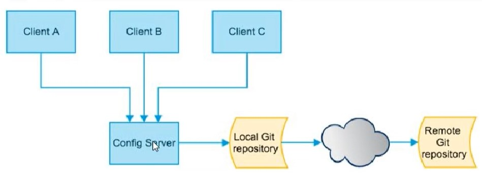

## config
1. 配置问题 - 集中式的、动态的配置管理(Bus)
    
2. 搭建服务端3344
3. 搭建git环境，配置IDEA的git账户信息等
4. 访问 http://config-3344.com:3344/config-dev.yml
5. 如果访问出错，在.shh下执行 ssh-keyscan example.com > known_hosts
6. 搭建客户端 3355
    - 新增配置文件 bootstrap.yml
        - application.yml 是用户级的资源配置项
        - bootstrap.yml 是系统级的，优先级高
7. 启动服务 访问地址 http://localhost:3355/configInfo
8. 修改配置文件 dev - prod，继续访问 http://localhost:3355/configInfo
9. 修改git上的配置文件，需要动态的刷新 ==> 手动版
10. POM引入 actuator 监控 依赖
11. 修改YML文件，暴露监控端口
    ```yaml
    management:
        endpoints:
          web:
            exposure:
              include: "*"
    ```
11. 控制层 -> @RefrenScope
12. 修改文件后，POST请求通知客户端 curl -X POST "http://localhost:3355/actuator/refresh"
13. 消息总线 ==> 动态刷新 Bus


## Bus 消息总线
1. 配置修改-动态刷新
2. 
3. 
4. 


## nacos


