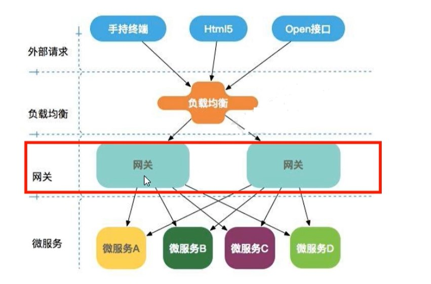
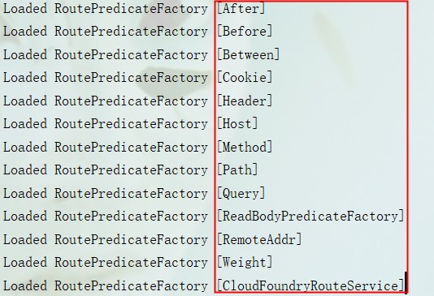

## Zuul （不再维护）


## Zuul2 （开发中）


## GateWay （新一代网关）
1. 选择GateWay的原因
    - zuul不再维护，zuul2还在开发中
    - GateWay 使用了Springboot2.x，Spring WebFlux,project Reactor ，Netty性能优势
    - 动态路由
    - 支持断言和过滤器
    - 集成Hystix断路器功能
    - 集成Spring Cloud 服务发现功能
    - 请求限流功能
    - 支持路径重写
2. 网关作用
    - 反向代理
    - 鉴权
    - 流量控制
    - 熔断
    - 日志监控
3. 网关位置
    
4. GateWay三大核心概念
    - Route 路由
      > 路由是构建网关的基本模块，它由ID，目标URI，一系列的断言和过滤器组成，如果断言为true则匹配路由
    - Predicate 断言
      > 参考JAVA8 的函数式接口，如果请求与断言相匹配则继续路由
    - Filter 过滤
      > 指的是Spring框架中GateWayFilter的实例，使用过滤器，可以请求被路由或之后对请求进行修改
    
5. 使用配置
    - maven依赖需要去掉 web 相关的依赖
    - yaml配置
        ```yaml
     spring:
       application:
         name: cloud-gateway
       cloud:
         gateway:  # 路由配置
           routes:
             - id: payment_routh # 路由的ID，没有固定规则但要求唯一，建议配合服务名
               uri: http://localhost:8001 # 匹配后提供服务的路由地址
               predicates: # http://localhost:8001/payment/get/**
                 - Path=/payment/get/** # 断言，路径相匹配的进行路由
     
             - id: payment_routh2
               uri: http://localhost:8001
               predicates:
                 - Path=/payment/lb/**
    ```
    - 访问 http://localhost:8001/payment/get/2 和 http://localhost:9527/payment/get/2
  
 6.  网关配置说明
    - yaml配置，见上面，选项可查看官网
    - 编码配置 GatewayConfig.java
    
7. 动态路由实现
    - yaml配置
    ````yaml
    spring:
       cloud:
         gateway:
           discovery:
             locator:
               enabled: true # 开启从注册中心动态创建路由的功能，利用微服务名称进行路由
            
           routes:
             ...
               # uri: http://locahost:8001
               uri: lb://cloud-payment-service # 匹配后提供服务的路由地址
    ````
    - 启动访问 http://localhost:9527/payment/lb
8. 断言-类型
    
    
9. Filter过滤器
    - filter
    - globalFilter
    - 自定义过滤器 MyLogGateWayFilter implements GlobalFilter,Ordered
    
10. 接口测试
    - jmeter
    - postman
    - curl