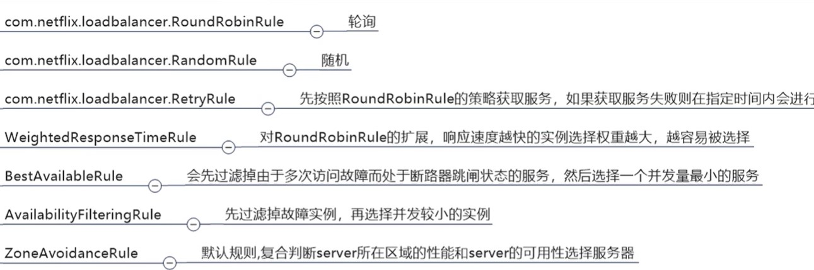
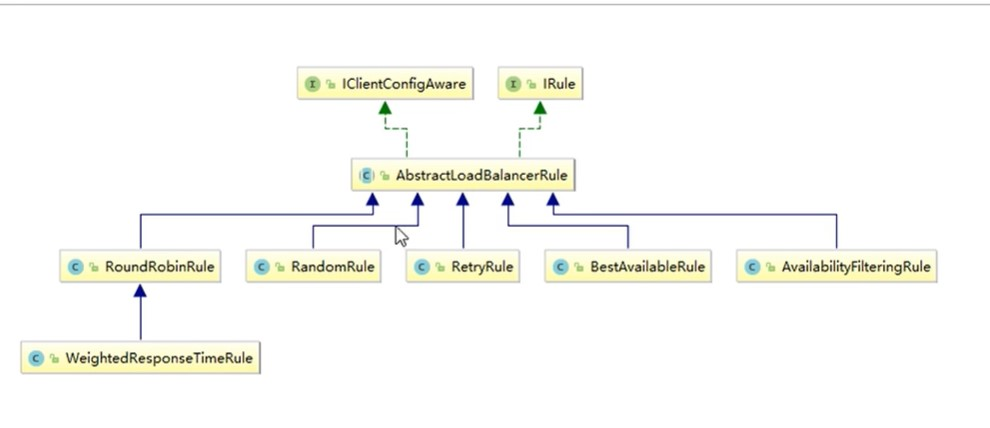
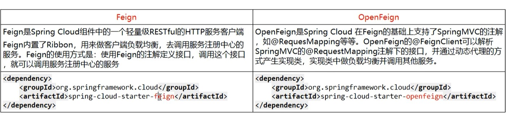

## Ribbon 已停更，但是大规模在使用
1. 客户端实现
2. 新版 eureka client 默认集成了 Ribbon
3. @LoadBalanced
4. 负载均衡算法
    - 
5. 修改默认负载均衡算法（轮询）
    - **自定义配置类不能放在 @ComponentScan 所扫描的当前包及子包下** MyRule.java
    - @RibbonClient(name = "CLOUD-PAYMENT-SERVICE", configuration = MySelfRule.class) // 访问 CLOUD-PAYMENT-SERVICE 服务，指定自己的负载均衡策略

6. 自定义轮询算 - IRule
    - 取掉 RestTemplate 配置类上的 @LoadBananced注解
    - 得到服务的总数，全局记录请求次数，求模返回下标
    - 公式 int i = requestCount % serviceCount
    - return services[i]
    


## LoadBanancer

# Feign 与 OpenFeign 简化 Ribbon 的操作
## Feign （默认集成了Ribbon）
1. Feign = Ribbon + RestTemplate
2. Feign = 注解@FeignClient + 接口(微服务接口)

## OpenFeign （Feign升级版 - 重点） 
1. OpenFeign = 注解@FeignClient + 接口(微服务接口)
2. SpringMVC 的注解支持
3. 超时控制
    - openfeign - ribbon 默认等待 1 秒
    - 消费端yml配置
        ```yaml
        # 设置 feign 客户端超时时间
        ribbon:
          # 指的是建立连接所有的时间，适用于网络状态正常的情况下，两端连接所用的时间
          ConnectTimeout: 5000
          # 指的是建立连接后从服务器取到可用资源所用的时间
          ReadTimeout: 5000
        ```
        
4. 日志增强
    - 配置 config
    - 配置yaml
        ```yaml
      # feign 日志增强
      logging:
        level:
          com.atguigu.springcloud.service.PaymentFeignService: debug
        ```



## 与Nginx负载均衡的区别
1. Nginx 是服务器负载均衡，客户端所有请求都会交给 nginx，然后由nginx实现请求转发，即负载均衡是由服务端实现的
2. Ribbon本地负载均衡，在调用微服务接口时候，会在注册中心上获取注册信息服务列表之后缓存到JVM本地，从而实现本地RPC远程服务调用计数